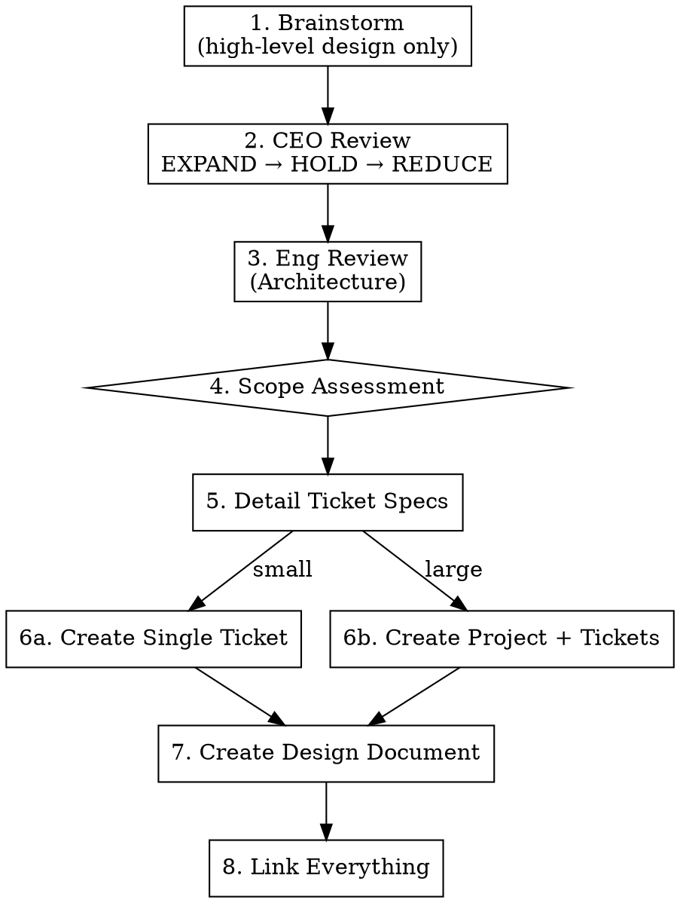

# Creating Linear Tickets

## Overview

Turn ideas into well-scoped Linear tickets through structured review. Orchestrates: brainstorm → CEO review → Eng review (architecture) → scope assessment → Linear creation.

Every ticket created by this skill has validated scope, reviewed architecture, clear acceptance criteria, and a linked design document — so `starting-linear-ticket` can execute without re-discovering context.

**Announce at start:** "Using creating-linear-tickets to turn this idea into actionable tickets."

## Required Input

An idea, feature request, bug report, or initiative. Can be:
- A verbal description ("I want to add Google Calendar integration")
- A Notion doc reference
- A Linear project/milestone to break down
- A bug report or user feedback

## Fast Path — Small, Well-Scoped Tickets

**Not every ticket needs the full workflow.** Skip brainstorming and reviews when ALL of these are true:

- The problem is obvious and well-understood (e.g., a specific bug with a known fix)
- The scope is already tight — one change, one area of the codebase
- There's no design ambiguity — no "should we do A or B?" questions
- The user has clearly articulated what they want

**Fast path:** Read the relevant code to understand the current state → create a well-formed ticket with problem statement, affected code, solution sketch, and acceptance criteria. No brainstorming, no CEO review, no Eng review.

**Examples of fast-path tickets:**
- "Day boundary uses UTC instead of local time" — it's a bug, the fix is clear
- "Add loading spinner to the save button" — tiny UI improvement, no ambiguity
- "Rename `foo` to `bar` across the codebase" — mechanical refactor

**Examples that need the full workflow:**
- "Add Google Calendar integration" — multiple approaches, scope unclear
- "Redesign the daily routine flow" — requires exploring alternatives
- "Add a weekly review feature" — new concept, needs CEO + Eng review

**When in doubt, ask:** "This seems well-scoped enough for a quick ticket. Want me to run the full workflow or just create the ticket?"

## Workflow (Full)

**IMPORTANT: Reviews happen early, before detailed ticket design.** The flow is: high-level design → reviews (challenge scope/architecture) → detailed ticket specs. Do NOT write detailed ticket descriptions, acceptance criteria, or scope before the reviews have run. The reviews exist to shape what the tickets should be.



### Step 1: Brainstorm (High-Level Design)

**REQUIRED SUB-SKILL:** Invoke `superpowers:brainstorming`

Provide the idea as context. Brainstorming should produce a **high-level design** — the shape of the work, major components, key decisions, and a rough ticket breakdown (names + one-line descriptions). Do NOT write detailed ticket specs (full acceptance criteria, detailed scope, etc.) at this stage — that comes after reviews.

Output should be:
- Key design decisions and trade-offs explored
- Rough dependency graph
- Ticket names + one-line summaries (not full specs)

**Do NOT save a design doc yet** — the design will be refined by the review phases.

### Step 2: CEO Review

**REQUIRED SUB-SKILL:** Invoke `plan-review-ceo`

Pass the brainstorming output. The CEO review runs EXPAND → HOLD → REDUCE and produces:
- **Building now** — what goes into tickets
- **Building later** — deferred with rationale
- **Not building** — explicitly killed

This may add, remove, or reshape tickets from the brainstorming output.

### Step 3: Eng Review (Architecture)

**REQUIRED SUB-SKILL:** Invoke `plan-review-eng` in **planning mode**

Pass the validated scope from CEO review. The Eng review produces:
- ASCII architecture diagram
- File list (create/modify)
- Failure modes
- Dependency graph for ticket ordering
- "What already exists" section

### Step 4: Scope Assessment

Auto-detect whether this is a single ticket or project with multiple tickets:

| Signal | Single ticket | Project + tickets |
|--------|--------------|-------------------|
| Architecture touches | 1-2 areas | 3+ distinct areas |
| "Building now" items | 1-3 related | 4+ or separable |
| Natural ticket count | 1 | 2+ vertical slices |
| Has "Building later" list | No or trivial | Yes, meaningful |

**Always ask to confirm** before creating: "This looks like [single ticket / a project with N tickets]. Sound right?"

### Step 5: Detail Ticket Specs

**Only now — after reviews have validated scope and architecture — write detailed ticket descriptions.** For each ticket, flesh out:
- Full scope (what's included, what's not)
- Acceptance criteria (specific, testable)
- Dependencies on other tickets
- **Verification** — observable signals, test scenarios, post-merge commands (see template below)
- **Implementation Snapshot** — produced by scout subagent in 5a
- **Sharp Edges** — pulled from memory in 5b
- Architecture notes from Eng review

Present each ticket to the user for validation before creating in Linear.

#### Step 5a: Scout subagent — produce Implementation Snapshot

For each ticket, spawn a scout subagent (Agent tool, `subagent_type: "general-purpose"`) using the brief in `scout-prompt.md`. The scout returns a markdown block containing:
- Files to modify / create
- Patterns to follow (with `<symbol>` in `<path>` references)
- Schema or types touched
- Current commit SHA at scout time

Paste this verbatim into the ticket's Implementation Snapshot section. The scout writes no code and proposes no changes — it only anchors the ticket in the current codebase.

This step is what makes a freshly created ticket immediately runnable: the implementing agent picks up real file paths and conventions, not generic guidance.

#### Step 5b: Sharp Edges — pull from memory

Grep memory feedback for entries whose subject intersects this ticket's scope. From `~/.claude/projects/-Users-kayleigh-dev-nextbest/memory/`:

```bash
grep -l -E '<keywords from ticket>' ~/.claude/projects/-Users-kayleigh-dev-nextbest/memory/feedback_*.md
```

Common keyword → memory mappings:
- Supabase migration / DDL → `feedback_postgrest_schema_cache`, `feedback_batch_db_calls`
- Bulk DB operations → `feedback_batch_db_calls`, NEX-159/164 `.range()` pagination notes (see project CLAUDE.md)
- UI copy / branding → `feedback_nextbest_lowercase`
- UI layout / spacing change → `feedback_playwright_ui_testing`
- Static asset swap → `feedback_static_asset_no_e2e`
- Supabase write to `profiles.is_admin` → `feedback_is_admin_trigger`
- Query optimization → `feedback_check_consumers_before_optimizing`

Inline only the rules that are actually relevant. Do not dump everything — noise erodes signal.

### Step 6a: Create Single Ticket

```
mcp__linear-server__save_issue with:
- title: Descriptive, action-oriented
- description: See ticket template below
- teamId: <team-id>  # Look up with list_teams
- stateId: <backlog-state-id>  # Look up with list_issue_statuses
- priority: 1-4 based on discussion
- labelIds: [Feature | Bug | Improvement]  # Look up with list_issue_labels
```

### Step 6b: Create Project + Tickets

1. **Create or find project** — Use existing milestone if applicable, otherwise create via `mcp__linear-server__save_project`
   - Put project-level context (architecture, scope decisions, success criteria, failure modes) in the **project description** — this is the design doc, not a separate document
2. **Create vertical-slice tickets** — Each delivers complete user value:
   - Include frontend + backend + tests in a single ticket
   - Order by dependency graph from Eng review
   - Each ticket is self-contained: all requirements, scope, and acceptance criteria are in the ticket description itself
3. **Create "Building later" tickets** — Separate backlog tickets with rationale preserved from CEO review
4. **Add dependency notes** — In ticket descriptions: "Depends on: PROJ-XX" where ordering matters
5. **Use Linear's `blocks`/`blockedBy` fields** to encode dependencies between tickets

### Step 7: Link Everything

- If project was created, ensure all tickets are linked to it
- Report back: list of created tickets with IDs and titles

**No separate design document.** Project-level design context goes in the project description. Ticket-level requirements go in the ticket description. This avoids information being split across multiple places.

## Ticket Description Template

```markdown
## Problem
<Problem statement — why are we building this?>

## Scope
<What's included, what's not. Specific enough for an implementer to work without asking questions.>

## Acceptance Criteria
- [ ] <Specific, testable condition>
- [ ] <Each criterion maps to a verifiable outcome>
- [ ] <Include both happy path and key edge cases>

## Verification

### Observable Signals
Declarative "what's true after this ships":
- <e.g., `GET /concern/<slug>` returns HTML containing `[data-testid="concern-summary"]` with text matching `tag_summaries.summary` for the matching tag UUID>
- <e.g., `tag_summaries` row exists for every tag in `tags` after backfill>
- <e.g., Sentry shows zero new errors in `app/concern/[slug]/page.tsx` for 1 hour post-deploy>

### Test Scenarios (TDD inputs)
Explicit cases the implementer must write — each becomes a failing test first:
- <e.g., looks up tag by slug, returns matching summary>
- <e.g., missing slug returns 404>
- <e.g., malformed slug normalized to lowercase>

### Post-Merge Verification
Runnable commands the agent executes during canary:
- <e.g., `curl -s https://nextbest.one/concern/acne | grep -q 'data-testid="concern-summary"'`>
- <e.g., Supabase MCP: `SELECT count(*) FROM tag_summaries` should equal `SELECT count(*) FROM tags`>

## Implementation Snapshot
*As of `<SHA>` on `<YYYY-MM-DD>`. Treat as hint — agent re-verifies on pickup.*
- **Files to modify:** <paths>
- **Files to create:** <paths>
- **Patterns to follow:** see `<symbol>` in `<path>` for <what>
- **Schema touched:** <tables / columns>

## Sharp Edges (Durable)
Project-specific traps relevant to this change:
- <e.g., After any DDL on this table, run `NOTIFY pgrst, 'reload schema'` before Vercel redeploys>
- <e.g., Supabase 1k-row cap — paginate any `.in()` query over `<table>`>
- <e.g., "Nextbest" → "nextbest" (lowercase) in any user-facing copy>

## Dependencies
<"Depends on: PROJ-XX" if applicable, or "None">

## Not In Scope
<Items explicitly deferred or cut>
```

**Why these sections matter for autonomous execution:**

- **Acceptance Criteria** = the contract.
- **Verification → Observable Signals** = the operational layer that makes the contract executable. Prevents "tests pass but behavior is wrong" bugs (slug-vs-UUID class).
- **Verification → Test Scenarios** = TDD inputs the implementer literally writes as failing tests first.
- **Verification → Post-Merge Verification** = canary commands the agent runs after deploy.
- **Implementation Snapshot** = codebase anchors so the agent doesn't reinvent helpers or pick wrong file paths. Snapshot is a hint — agent re-verifies on pickup before trusting it.
- **Sharp Edges** = curated subset of accumulated tribal knowledge, scoped to this change.

**No separate design document.** Project-level context (architecture, data flow, scope decisions, failure modes, success criteria) lives in the project description. Each ticket is self-contained with its own requirements.

## Common Mistakes

### Creating tickets without acceptance criteria
- **Problem:** Executor doesn't know what "done" looks like
- **Fix:** Every ticket gets specific, testable acceptance criteria derived from the review phases

### Horizontal instead of vertical ticket slicing
- **Problem:** "Create API route", "Create component", "Create hook" — none deliver value alone
- **Fix:** Each ticket is a vertical slice: backend + frontend + tests = usable feature

### Skipping reviews for "obvious" features
- **Problem:** Assumptions go unchallenged, scope creeps during implementation
- **Fix:** Run the full workflow. CEO review catches bad assumptions, Eng review catches architectural issues.

### Not preserving rationale for deferred items
- **Problem:** "Building later" items lose context, become meaningless backlog entries
- **Fix:** Include WHY it was deferred and WHAT would trigger building it

## Red Flags
- "This is just one quick ticket, we don't need all this"
- "The acceptance criteria are obvious"
- "Let me just create the tickets and start coding"
- "We can figure out the architecture during implementation"

**All of these mean: Run the workflow. Cheap questions now save expensive rework later.**
