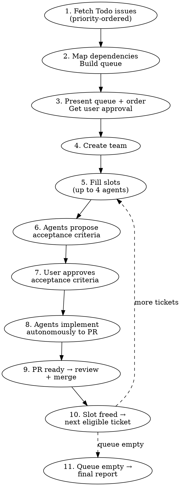

# Linear Todo Runner

## Overview

Work through all Todo tickets in a Linear team. Fetches issues, maps dependencies, and runs a rolling queue of agents — spawning new ones as slots open up. Each agent pauses for acceptance criteria approval before implementing.

## When to Use

- 2+ issues in Todo state ready to work on
- You want to maximize throughput across your backlog
- User says "run through my tickets", "work my todos", etc.

## When NOT to Use

- Single ticket — use `starting-linear-ticket` directly
- Issues need design decisions before scoping

## Process



### Step 1: Fetch Todo Issues

Fetch all issues with state "Todo" for the team:

```
mcp__linear-server__list_issues with team: "<team-name>", state: "Todo"
```

Use `get_issue` on each to get full descriptions.

Sort by Linear priority: Urgent (1) → High (2) → Medium (3) → Low (4).

Extract per issue: identifier, title, full description, priority, labels, project (if any).

### Step 2: Map Dependencies & Build Queue

Read every issue's full description. Identify:
- Explicit blocking relationships in Linear
- Implicit dependencies from descriptions (e.g., "table must exist before frontend can query it")
- Shared code areas that would cause merge conflicts if worked simultaneously

Build a **priority queue** — a flat ordered list where:
- Higher priority issues come first
- Issues with unmet dependencies are marked as blocked (they become eligible once their dependency merges)
- Issues touching the same files/areas are flagged as conflicting (only one can run at a time)

### Step 3: Present Queue for Approval

Show the user:

| # | Issue | Priority | Area | Blocked By | Conflicts With |
|---|-------|----------|------|------------|----------------|
| 1 | NEX-15 | High | frontend | — | — |
| 2 | NEX-22 | Medium | pipeline | — | NEX-27 |
| ... | ... | ... | ... | ... | ... |

Highlight which issues will start immediately (first 4 eligible) and which are waiting on dependencies.

**Wait for user approval before proceeding.** User may reorder or remove tickets.

### Step 4: Create Team

```
TeamCreate → team name: "todo-runner"
```

### Step 5: Fill Agent Slots

Maintain up to **4 concurrent agents**. When a slot opens, pick the next eligible ticket from the queue:
- Not blocked by an unmerged dependency
- Not conflicting with a currently-running ticket
- Highest priority among eligible

For each ticket spawned:

1. **Mark the Linear issue as "In Progress"**
2. Spawn the agent

```
mcp__linear-server__update_issue with id and state: "In Progress"
```

```
Task tool:
  subagent_type: "general-purpose"
  team_name: "todo-runner"
  name: "agent-{issue-identifier}"  (e.g., "agent-nex-170")
  mode: "default"
```

**Agent prompt template:**

```
You are working on Linear issue {IDENTIFIER}: "{TITLE}"

## Issue Description
{FULL_DESCRIPTION}

## Phase 1: Acceptance Criteria (STOP after this)

Read the issue description and explore the relevant codebase. Then propose
specific, testable acceptance criteria for this issue. Format as a numbered
checklist.

Send your proposed acceptance criteria back to the team lead using SendMessage.
Do NOT proceed to implementation until the team lead approves your criteria.

## Phase 2: Implementation (after approval)

Once your acceptance criteria are approved, follow the `starting-linear-ticket`
skill workflow with these modifications:

- **Skip Steps 1-2** (fetch ticket, mark In Progress) — the lead already did this.
- **Skip Step 4** (brainstorm) — use the approved acceptance criteria as your design.
- **Start at Step 3** (create worktree) and continue through Step 11.
  - Worktree: git worktree add {WORKTREE_PATH} -b {BRANCH_NAME} origin/main
  - If the project has multiple repos, create worktrees FROM each repo's directory.

After Step 11 (Linear updated to In Review), also:
- Send PR URL, code review summary, and implementation summary to team lead via SendMessage.

## Important
- Check the installed version of frameworks in package.json before making
  assumptions about API conventions
- Use pnpm for frontend, uv for Python projects
- NEVER commit directly to main — ALL changes go through a worktree + branch + PR
- If the team lead sends you feedback or fix requests after your PR is submitted,
  push the fix to YOUR branch (the PR branch), NOT to main
- NEVER mark Linear as "In Review" until CI passes
```

### Step 6-7: Acceptance Criteria Approval

Each agent sends proposed acceptance criteria via SendMessage. The lead:

1. Receives criteria from each agent
2. Presents criteria to the user **one at a time** — do NOT batch multiple agents' criteria into a single message. Present one, wait for the user's response, then present the next.
3. User approves, modifies, or rejects each
4. Lead sends approval (or revised criteria) back to each agent via SendMessage

### Step 8: Agents Implement

After approval, agents proceed autonomously through implementation → test → PR → code review.

Agents should run the `superpowers:code-reviewer` on their own PR and fix Critical/Important issues before reporting back.

Monitor via TaskList. If an agent reports a blocker, help resolve it.

### Step 9: PR Review & Merge

When an agent completes and reports its PR:

1. Present the PR and code review findings to the user
2. User reviews (in GitHub or via diffs)
3. Address any review feedback — send fixes back to agent or fix directly
4. **Wait for user to approve**
5. Merge: `gh pr merge <number> --squash --delete-branch`
6. Clean up worktree
7. Update Linear issue to "Done"

**Do this per-PR as they finish** — don't wait for all agents to complete.

### Step 10: Fill Freed Slot

After a PR merges:
1. Check if any blocked tickets are now unblocked (their dependency just merged)
2. Pick the next eligible ticket from the queue
3. Spawn a new agent (go to Step 5)

If no eligible tickets remain, wait for running agents to finish.

### Step 11: Final Report

When the queue is empty and all agents are done, report:

| Issue | PR | Status |
|-------|-----|--------|
| NEX-15 | #42 | merged |
| NEX-22 | #43 | merged |
| ... | ... | ... |

Shut down team: SendMessage type "shutdown_request" to each agent, then TeamDelete.

## Key Rules

- **Rolling queue** — don't wait for all agents to finish; fill slots as they open
- **Priority ordering** — Urgent → High → Medium → Low determines queue position
- **Dependency gating** — blocked tickets only become eligible after their dependency's PR is merged
- **Conflict avoidance** — tickets touching the same code areas don't run simultaneously
- **Max 4 agents simultaneously** — resource constraints
- **Each agent gets its own worktree** — no shared workspace
- **Agents STOP after proposing acceptance criteria** — user must approve before implementation
- **User approves queue order before starting** — no surprises
- **Preserve existing Linear labels** when updating issue status
- **Lead NEVER does implementation directly** — all work (code, tests, fixes, CI debugging, ad-hoc bugfixes, quick UI tweaks) must be delegated to agents or subagents. The lead coordinates, reviews, and communicates with the user. If the user reports a bug or requests a change during the run, spawn a subagent to fix it — do NOT edit code yourself, even if it seems trivial.
- **NEVER commit directly to main** — every change, no matter how small, must go through a PR. If the user gives feedback on a completed PR, push the fix to that PR's branch — do NOT commit to main. If the PR is already merged and a fix is needed, spawn a subagent to create a new worktree + branch + PR for the fix. Zero exceptions.

## Quick Reference

| Step | Action | Tool |
|------|--------|------|
| Fetch issues | Get all Todo issues for team | `mcp__linear-server__list_issues` state: "Todo" |
| Full descriptions | Get each issue's full text | `mcp__linear-server__get_issue` |
| Map dependencies | Build priority queue | Manual analysis |
| Present queue | Show order + deps to user | Direct output |
| Create team | Set up coordination | `TeamCreate` |
| Spawn agent | Fill an open slot | `Task` (general-purpose) |
| AC approval | Review with user | `SendMessage` |
| PR merge | Per-PR as they finish | `gh pr merge` |
| Fill slot | Next eligible ticket | Check queue → spawn |
| Report | Final summary table | Direct output |
| Cleanup | Shut down team | `SendMessage` (shutdown) + `TeamDelete` |
