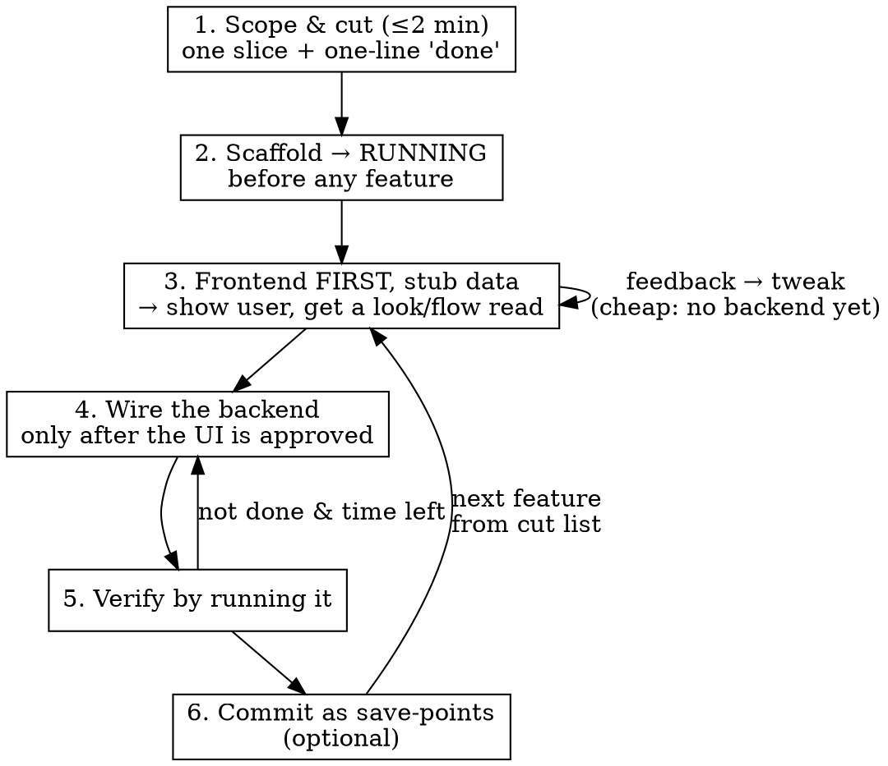
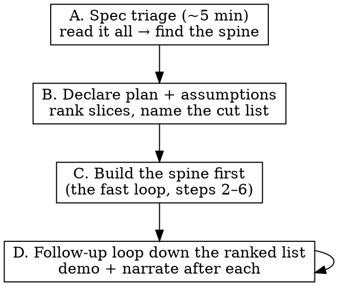

# Spinning Up a Prototype

## Overview

A deliberately lightweight workflow for throwaway, time-boxed builds. The goal is **one working vertical slice the user can see run** — nothing else.

**Core principle:** Ship one happy path. Suspend ceremony *on purpose*, not by forgetting. Every ritual you skip here is one you'd keep in real work.

**Announce at start:** "I'm using the rapid-prototype skill — fast mode, ceremony suspended."

## When to Use

- Time-boxed builds: interview prototype, live demo, hackathon, spike
- Throwaway proof-of-concept that will NOT be maintained
- You need something running in minutes, not a production-ready feature
- **Scope bigger than the time box** — a large or ambiguous spec you can't finish, where what matters is how you prioritize and how coherent the result is (hackathons, take-homes, spikes, an afternoon to explore a big idea). See [Scaling up](#scaling-up-big-ambiguous-specs).

**When NOT to use — use `starting-linear-ticket` instead:**
- Code that will be maintained, merged, or shipped to production
- Anything touching real user data, money, auth secrets, or migrations on a real DB
- Work where correctness matters more than speed

Throwaway ≠ careless. Even in fast mode: no irreversible/destructive commands, no committing secrets, no touching production systems.

**Graduating to real** — when the ask becomes real auth, a real database, or deploying to prod infra (GitHub/Vercel/etc.), the prototype is leaving throwaway territory. Say so: the deliberate stubs (in-memory store, no-auth) were the point, and going real changes the demo (e.g. instant → a login step). Switch out of fast mode for the real parts, and treat external systems with care (next section).

## Permission to Go Fast

This skill **overrides** the heavy defaults in your global instructions and the superpowers hook for the duration of the prototype. Without this section, the agent will keep reaching for brainstorming, TDD, and worktrees out of habit and burn the time box.

**Explicitly suspended for this session.** Do NOT invoke these:

| Heavy ritual (normal work) | Fast-mode replacement |
|---|---|
| Linear ticket + status updates | Skip. One line of scope in chat is enough. |
| Brainstorming skill (Q&A, 2-3 approaches, design doc) | 2-minute scope-and-cut, below. |
| plan-review-ceo / plan-review-eng | Skip. |
| Git worktree | Work directly on `main` in a fresh dir. |
| TDD (test-first) | Verify by **running it** — browser, CLI, curl. |
| Subagents per task | Solo. Spawn agents only for genuinely parallel, independent chunks. |
| Code review + CI + PR + merge | Skip. Commit to `main` as save-points only. |

## The Workflow



### 1. Scope & cut (≤2 min)

Pick the **single vertical slice** that best demonstrates the idea end-to-end. Write one line: *"Done = the user can ____."* Everything else goes on a **cut list** (keep it visible — it's how you articulate trade-offs later: "next I'd add X").

Ruthless YAGNI: no auth unless the demo needs it, no settings, no edge cases, one entity not five.

### 2. Scaffold → running first

Get an empty app running **before** writing any feature code, so setup failures surface early, not at minute 25.

```bash
# Worked example: Next.js + Supabase (adapt to the chosen stack)
npx create-next-app@latest proto --ts --tailwind --eslint --app --no-src-dir --yes
cd proto && npm install @supabase/supabase-js @supabase/ssr
npm run dev   # confirm it loads BEFORE going further
```

Verify the flags against the installed version — don't trust memory for scaffolding CLIs. **If the scaffold pins a major version newer than your training (check `package.json`, watch for an `AGENTS.md`/`CLAUDE.md` warning), read the local docs in `node_modules/<framework>/dist/docs/` — or use `verify-library-api` — BEFORE writing any data/routing code.** Version traps (e.g. async `params`, Server Actions, renamed config) cost more debugging time mid-build than the 60 seconds it takes to read the doc. For a DB-backed slice, get one connection-proving read working before building the feature.

### 3. Frontend first, with stub data

**Build the UI before the backend.** Hardcode or mock the data, make it interactive with local state (fake the vote, fake the submit), and **show the user / get a look-and-flow read before wiring anything.** Visual feedback is the highest-value, lowest-cost signal you get — and changes (restyle, add a variant, rework the flow) are *cheap* while there's no backend to refactor. One slice only; resist gold-plating.

### 4. Wire the backend

Only after the frontend is approved. Replace the stub with real persistence/state, keeping the same component surface so the UI barely changes. Build only what the "done" line requires — seed/hardcode anything off the happy path.

### 5. Verify by running it

Run the actual thing and watch it work — browser (Chrome MCP), CLI, or curl. No test suite. If it breaks, fix the one path; don't generalize. For browser checks, prefer a dedicated form-fill (`form_input`) over click-then-type, and re-read element refs after any window resize — coordinate clicks go stale.

### 6. Commit as save-points (optional)

`git init && git add -A && git commit` at milestones — rollback insurance, not a PR. Never push a throwaway to a shared remote without asking. **Commit after every working feature** so you always have a green, demoable state to fall back to.

### 7. Follow-up loop (repeat as needed)

Once the first slice runs and is committed, **the cut list becomes your feature queue.** When more is wanted (by you or whoever you're building with), add features one at a time:

- **Pick the highest-leverage item** from the cut list — the one that's most demo-able or most asked-for, not the easiest.
- **Run the same loop** (steps 3→5): frontend-first with stub data if it's visual → quick read → wire → run.
- **One at a time, always green.** Never leave two features half-built. Finish and commit each before starting the next — a working 2-feature demo beats a broken 4-feature one.
- **Reuse the surface.** Extend existing components/types; don't re-architect mid-demo (e.g. adding poll *types* reused one render path).
- **Fall back fast.** If a follow-up blows its mini-timebox or breaks the build, reset to the last save-point and pick a cheaper item. The demo staying live matters more than any one feature.

### Parallel agent waves (the fan-out)

When several cut-list features are independent, don't build them one at a time — **fan out a wave of subagents, one feature each, then review the wave together.** This is the highest-leverage way to use AI tooling on a prototype, and the review step is where you keep ownership of the output.

The loop: **shared substrate first → parallel wave → review → integrate.**

- **Build the shared substrate yourself first.** The data layer/store, schema, and shared types are what features collide on. Build (or extend) those *before* fanning out, exposing stable functions each agent builds on. This is the coupled core — don't parallelize it.
- **Scope each agent to separate files/routes.** One feature = one new page/route/component owning its own files. **Never run parallel agents that edit the same shared file — they clobber each other.** If two features must touch one file, sequence them or give one agent both.
- **Give each agent a tight contract:** the files it owns, the store functions it may call (already built), the acceptance criterion, and "fast mode — no tests/PR, just make it work and run."
- **Review the wave as it lands**, then **hand it to your collaborator and STOP.** Verify it integrates (typecheck, every route, run the app), then surface the *running app* — not a written feedback essay — and let them drive the feedback. Revise against their notes, and **do not auto-advance to the next wave** until they say the current one is good. Keep the review checkpoint fast: findings-first, batched, no slow page-by-page click-through.

## Scaling up: big, ambiguous specs

When the spec is bigger than the time you have (hackathons, take-homes, spikes, a quick exploration of a big idea), you can't finish — so what matters is **how you prioritize an over-scoped problem and how coherent the result is**, not coverage. The fast loop still runs underneath; this is the judgment layer on top.

**If you're building with someone, the spec and priorities are co-defined, not handed down.** Surface the key calls and talk them through — don't disappear and return with a finished plan. Decide the small stuff yourself to keep momentum; align on the big stuff together.



- **A. Spec triage → align (~5 min).** Read the whole spec once. *Propose* the **spine** — the single end-to-end path that proves the core idea works — plus 3–5 candidate slices ranked by *demo-value ÷ cost* and an explicit **"won't build today"** list. **If you have a collaborator, talk the spine and priorities through with them before building** — co-defining scope is the point of a collaborative session, not a solo decision to present after the fact. Make the reasoning explicit either way (out loud, in a README, in commit messages).
- **B. Decide the small stuff, surface the big stuff.** Local/implementation ambiguities (single-tenant? which library? in-memory vs DB?): **decide, state the assumption, move** — don't ask endlessly. Direction-setting ambiguities (what are we even building? what matters most? what's the core?): **raise them with your collaborator** rather than locking them unilaterally. Record decisions so they stay revisitable.
- **C. Build the spine first** as your vertical slice — the hardest/most interesting part, not the easiest. A working spine anchors everything else.
- **D. Run the follow-up loop** down your ranked list, checking the result after each. Each cut is a deliberate trade-off you can point to: *"faking auth to spend the time on the matching engine — that's the actual hard problem here."*
- **Leave it coherent.** A smaller, working, deliberately-architected result plus a crisp "here's exactly how I'd continue" beats a sprawling broken one. The output should visibly reflect deliberate choices, not random coverage.

**Anti-pattern:** trying to touch every part of the spec → everything half-built, no demo, no story. Depth on the spine > breadth across stubs.

## Quick Reference

| Step | Action | Time-box feel |
|---|---|---|
| 1 | Scope to one slice, write "done", start a cut list | ≤2 min |
| 2 | Scaffold until it RUNS (read local docs if version is pinned/new) | get it green early |
| 3 | Frontend first with stub data → show user, get a read | fast visual signal |
| 4 | Wire the backend (after UI approved) | bulk of the time |
| 5 | Run it and watch it work | continuous |
| 6 | Commit save-points (after every working feature) | as you go |
| 7 | Follow-up loop: next cut-list item → repeat 3–5 | one at a time, stay green |

## Common Mistakes

### Building infrastructure before proving the slice
- **Problem:** Auth, DB schema for 5 tables, routing for pages you'll never demo — time gone, nothing visible.
- **Fix:** One entity, one page, one happy path. Infra only when the slice needs it.

### Getting dragged back into ceremony
- **Problem:** Habit (or the superpowers hook) pulls you into brainstorming/TDD/worktrees and the clock runs out.
- **Fix:** Re-read the suspension table. This skill is explicit permission to skip them.

### Over-scoping
- **Problem:** Trying to demo three features; all three are half-done at the buzzer.
- **Fix:** One slice fully working. Put the rest on the cut list and *talk* about it instead of building it.

### Setup failure discovered late
- **Problem:** Spent 20 min on features, then the build won't start.
- **Fix:** Step 2 — get the empty app running first.

### Wiring the backend before the UI is approved
- **Problem:** You build persistence, then the user wants a different layout/flow — now you refactor the backend too.
- **Fix:** Frontend first with stub data. Get the look/flow read while changes are free, then plumb.

### Trusting training knowledge on a pinned new framework version
- **Problem:** Scaffold pins a major version with breaking changes (async `params`, renamed config); you write the old pattern and burn time debugging.
- **Fix:** Check `package.json` and any `AGENTS.md`. Read the local `node_modules/<framework>/dist/docs/` before data/routing code.

### Scattering LLM calls / hard-coding a provider
- **Problem:** An AI feature is wired inline across files; the user has no API key yet, or switches provider/model mid-build, and you're refactoring everywhere.
- **Fix:** Put the LLM call behind ONE function (`lib/coach.ts`) with a deterministic fallback so the app runs with no key and swapping provider/model is one line. Keep the key server-side. The provider can change on a whim ("use OpenAI, I have credits") — isolation makes that free.

### Running a migration or deploy against the wrong project
- **Problem:** "Make the data real" / "deploy it" fires against a **production** project or account — a connected DB or MCP tool often defaults to prod, and "create a throwaway" may not even be possible through it.
- **Fix:** Before ANY write to a real external system (DB migration, deploy), **verify the target is the throwaway/sandbox, not production** — check the actual project ref/URL the tool resolves to, don't assume. If it points at prod, stop and surface it. External logins (Vercel, GitHub, auth providers) and their secrets are the user's to do — hand those off with exact commands; never fake or guess them.

## Red Flags

- "Let me set up the worktree / Linear ticket first" → no, work on `main`
- "I'll write a test for this" → no, run it instead
- "Let me also add..." → cut list, not code
- "I should brainstorm the approach" → 2-minute scope, then build
- "Let me build the schema properly for the full feature" → seed/hardcode the one slice
- "I'll wire the backend first, then style it" → frontend first with stub data, get a read
- "I know how this framework works" → check the pinned version; read local docs if it's new
- "Let me start the next feature, I'll finish this one after" → no, finish + commit one at a time, stay green
- "Wave's built, on to the next one" → no, hand it to your collaborator, revise on their notes, advance only when they say
- "I'll run the migration / deploy now" → first verify the target is the sandbox, not production

**All of these mean: you've left fast mode. One slice, running, now.**
